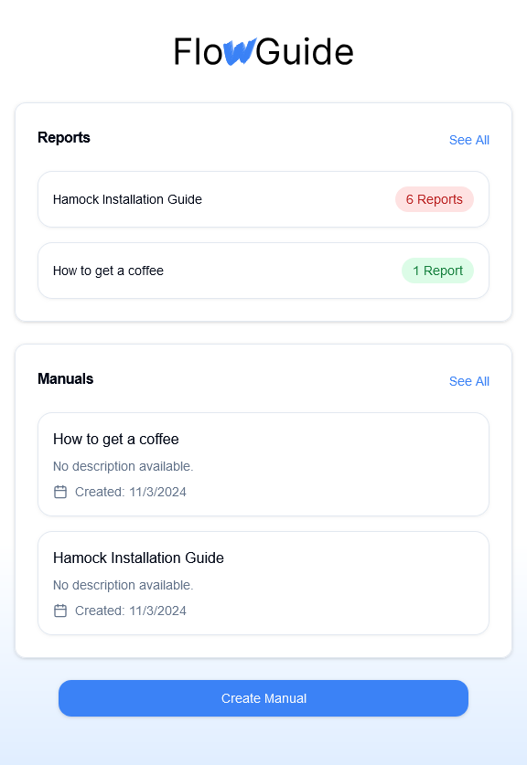

# FlowGuide

## Getting Started

To run this example, simply do:

```sh
pnpm i
pnpm dev
```

Then you will see the following dashboard screen:



## IDE setup

VSCode or Cursor is highly preferred. Please ensure you have installed these extensions:

- Prettier
- stylelint
- eslint

## Useful Commands

```sh
#to run in dev mode
pnpm dev

#to run in qa or production env. Expect to run this in docker
pnpm start

#to clear cache and .next folder
pnpm cc
```


## Application Page Structure

This application is organized into several key pages. Here’s an overview of the main pages:

### `/` - Home/Dashboard
  - **Overview**: Displays list of available manuals/guides
  - **Purpose**: Entry point for users to select a guide

### `/[manualID]` - Manual View
  - **Dynamic Route**: Dynamic route that displays a specific manual/guide
  - **Features**:
    - Step-by-step instructions, complete with images.
    - Interactive progress bar to track completion.
    - Simple Next/Back navigation.
    - Contextual help link for each step, leading to the help page.

### `/[manualID]/help` - Help View
  - **Contextual Support**: Offers additional guidance specific to each step within the manual.
  - **Assistance Provided For**:
    - Contextual help page for specific steps
    - Shows additional assistance based on:
      - User picture
      - Current step
      - Next step
      - Overall progress

### `/[manualID]/edit` - Edit Manual
  - Enables users to modify the content of a selected manual or guide.

### `/[manualID]/overview` - Manual Overview
  - Displays a high-level overview of the selected manual.

### `/create` - Create New Manual
  - **Functionality**: Allows users to create a new manual or guide with AI.
  - **Features**:
    - Title and description for the new manual/guide
    - User can select pictures for each step
    - AI will generate the step by step instructions for each step

### `/manuals` - All Manuals
  - **Navigation**: Quick access to any guide.

### `/reports` - Reports Dashboard
  - **Analytics and Reports**: Presents a list of manuals with an overview of user issues

---

### Technical Details
This app is built with **Next.js 14+**, utilizing the latest app router architecture. Each route leverages **server components** by default for optimal performance, with **client components** incorporated selectively for enhanced interactivity.


## Design Philosophy - Dev Environment

### 💡 Rule: Hot Reload should be supported during development

Hot Reload is important for frontend development as the changes can be reflected in a very quick manner. Hot reload feature is already supported by the latest version of Nextjs. Any changes on the source files would trigger rebuilding the application automatically.

### 💡 Rule: Code Linting is required

Linters are added into this project template to enhance code quality.

For javascript, [eslint](https://eslint.org/) is used, extending rules from [airbnb-base](https://www.npmjs.com/package/eslint-config-airbnb-base) and [react/recommended](https://github.com/yannickcr/eslint-plugin-react)

```sh
#To check js syntax
pnpm lint
```

## Design Philosophy - Application Design

### 💡 Rule: Need a clear layout structure

Every page in the same project actually shares the same structure. We make good use of some Nextjs features and some custom components to organize the pages:

#### app/layout.tsx

This is a custom component, which is more about look and feel structure of any page. For a typical webpage, we usually need a define the header, the footer and where to show the main content.

## Design Philosophy - JS

### 💡 Rule: Ensure imported modules are universal

Not all javascript libraries can be run on both server and client side. When you pick a module to use, make sure it is universal.

## Design Philosophy - Quality Control

### 💡 Rule: Ensure every page can be loaded from server side and client side

The great thing Nextjs provides to us is React with SSR, which means any page can be access from server side and client side. This also means that you have to ensure your page should be functional when entering from server side or client side.
